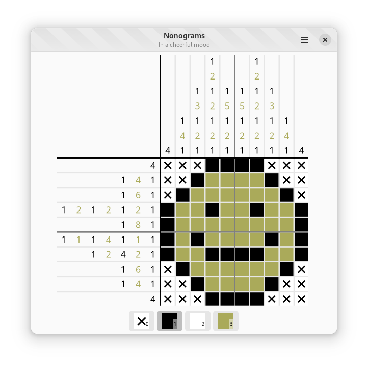

# Nonograms

A WIP [Nonograms](https://en.wikipedia.org/wiki/Nonogram) game written using Zig
and GTK.

Building this project currently requires the latest version of
[zig-gobject](https://github.com/ianprime0509/zig-gobject) to be checked out as
a sibling directory to this one, with all the caveats on compiler support
mentioned in its README. In other words, it is not yet really suitable for
general consumption, but will become so as the Zig package manager matures.
